# Component Diagram - EC Site Application

## Overview
This document provides detailed component diagrams showing the architecture of our e-commerce application, including component interactions, dependencies, and data flow.

---

## 1. System-Level Component Diagram

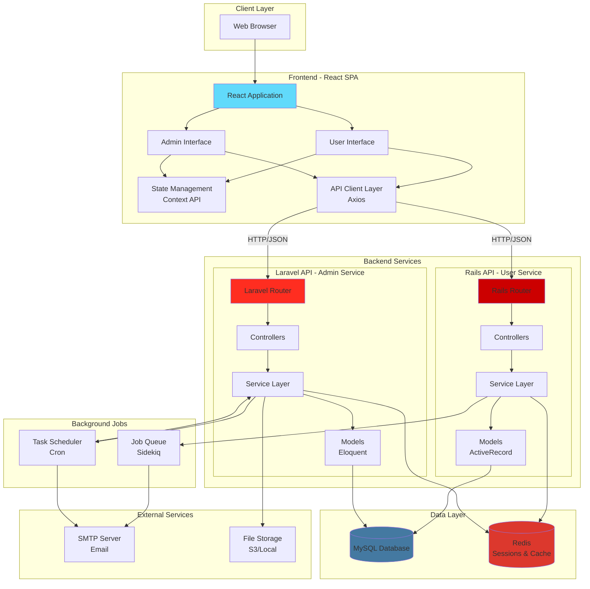

---

## 2. Frontend Component Architecture

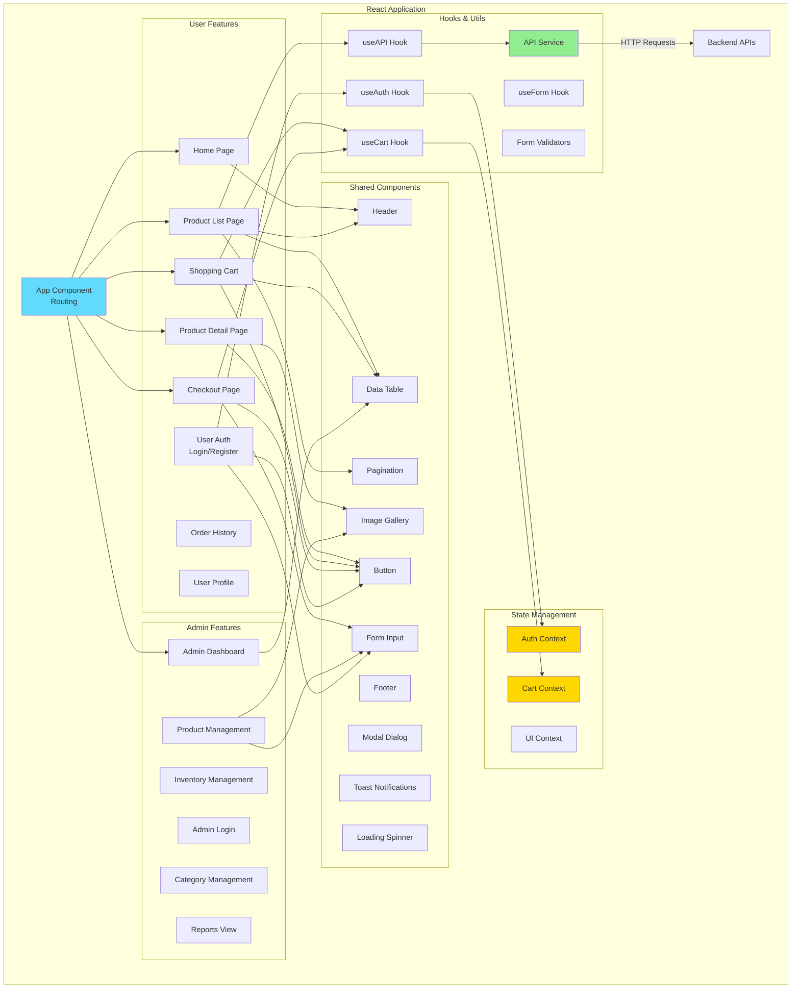

---

## 3. Rails Backend Component Architecture

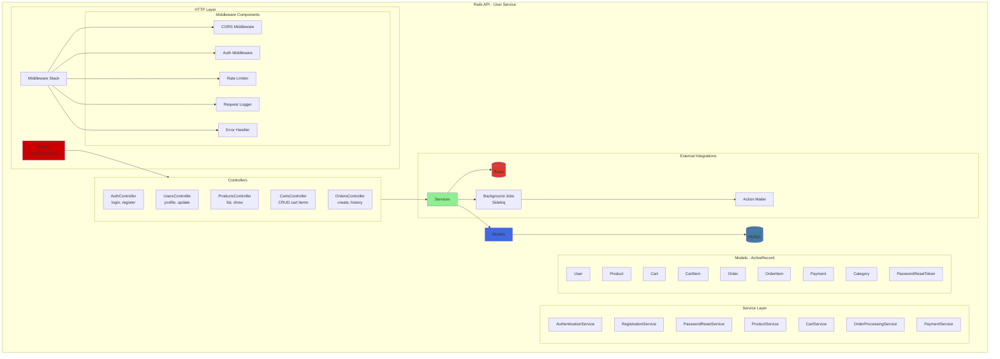

### Rails Component Responsibilities

| Component | Responsibility | Key Methods |
|-----------|----------------|-------------|
| **AuthController** | Handle login/logout requests | `login`, `logout`, `refresh_token` |
| **AuthenticationService** | Validate credentials, generate JWT | `authenticate`, `generate_token`, `verify_token` |
| **RegistrationService** | Create new users, send confirmation | `register`, `confirm_email`, `send_confirmation` |
| **ProductService** | Query products with filters | `list`, `search`, `filter_by_category` |
| **CartService** | Manage cart operations | `add_item`, `update_quantity`, `remove_item`, `get_cart` |
| **OrderProcessingService** | Orchestrate checkout flow | `execute`, `validate_cart`, `deduct_inventory`, `process_payment` |
| **PaymentService** | Mock payment processing | `process`, `generate_transaction_id`, `validate_payment` |

---

## 4. Laravel Backend Component Architecture

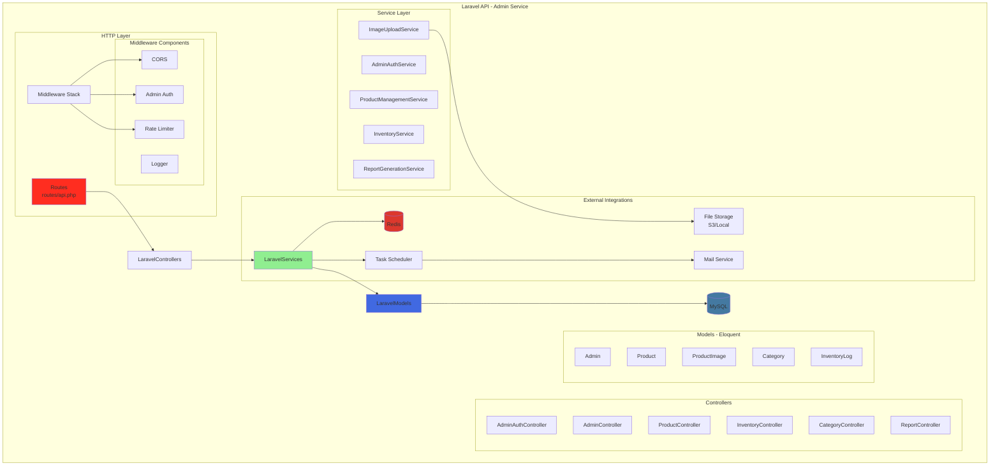

### Laravel Component Responsibilities

| Component | Responsibility | Key Methods |
|-----------|----------------|-------------|
| **AdminAuthController** | Admin authentication | `login`, `logout`, `verify` |
| **ProductController** | Product CRUD operations | `index`, `store`, `update`, `destroy`, `suspend` |
| **ProductManagementService** | Product business logic | `create`, `update`, `delete`, `toggle_suspension` |
| **InventoryController** | Inventory adjustments | `adjust`, `history`, `low_stock_alert` |
| **InventoryService** | Inventory business logic | `adjust_stock`, `log_change`, `get_audit_trail` |
| **ImageUploadService** | Image upload handling | `upload`, `delete`, `validate` |
| **ReportGenerationService** | CSV report generation | `generate_inventory_report`, `format_csv`, `save_file` |
| **ReportController** | Trigger reports, download | `generate`, `download`, `list` |

---

## 5. Data Flow Diagrams

### 5.1 User Login Flow

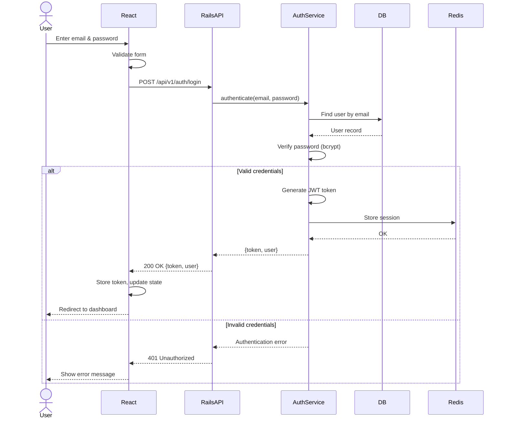

### 5.2 Product Browsing Flow

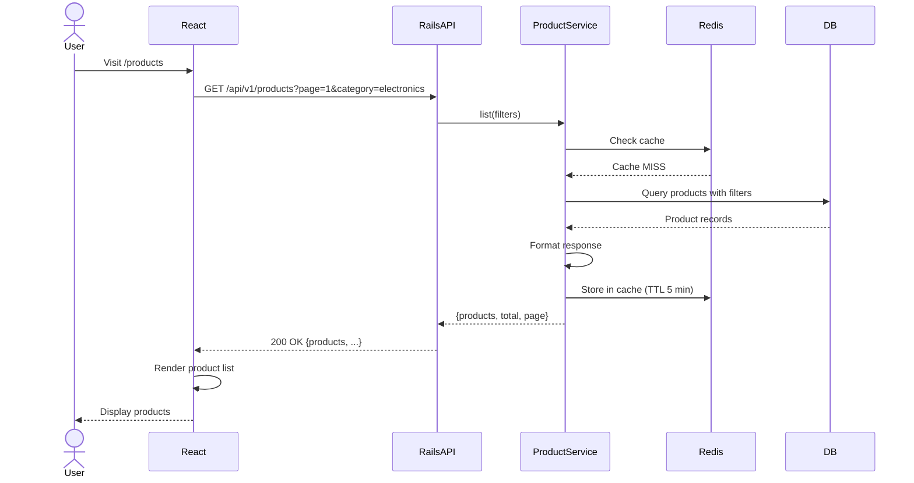

### 5.3 Checkout with Concurrency Handling

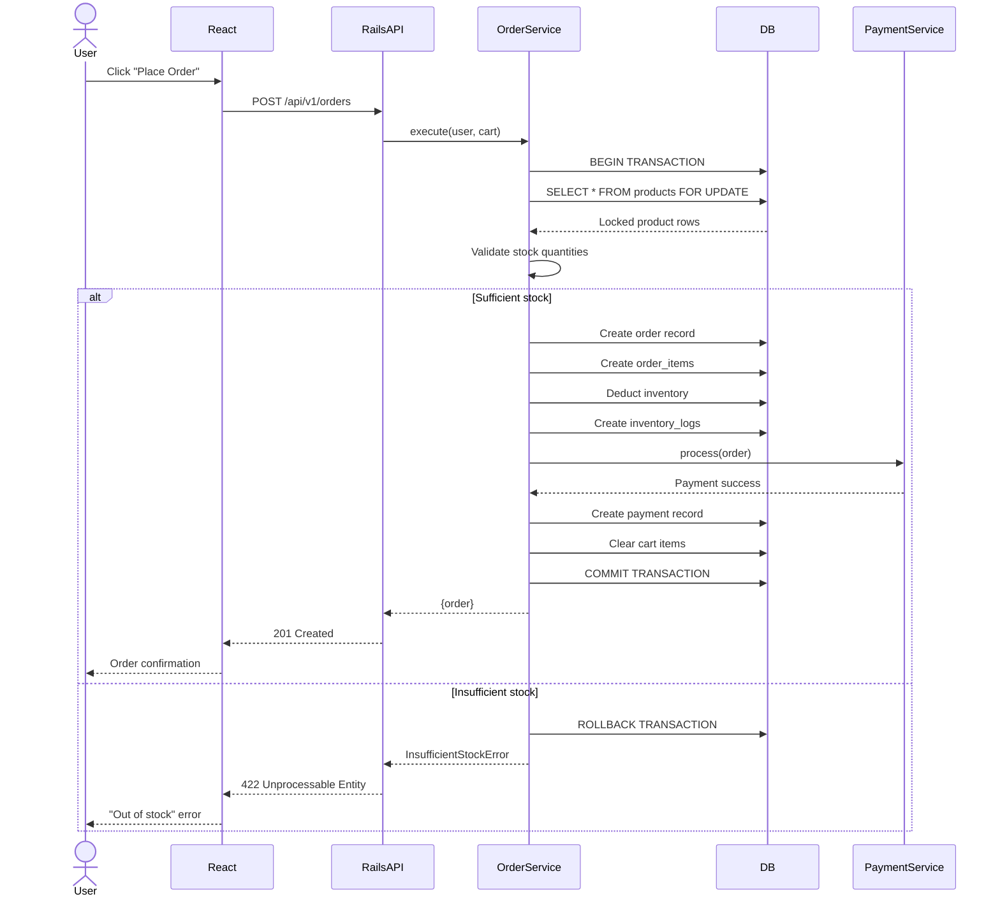

### 5.4 Admin Product Creation

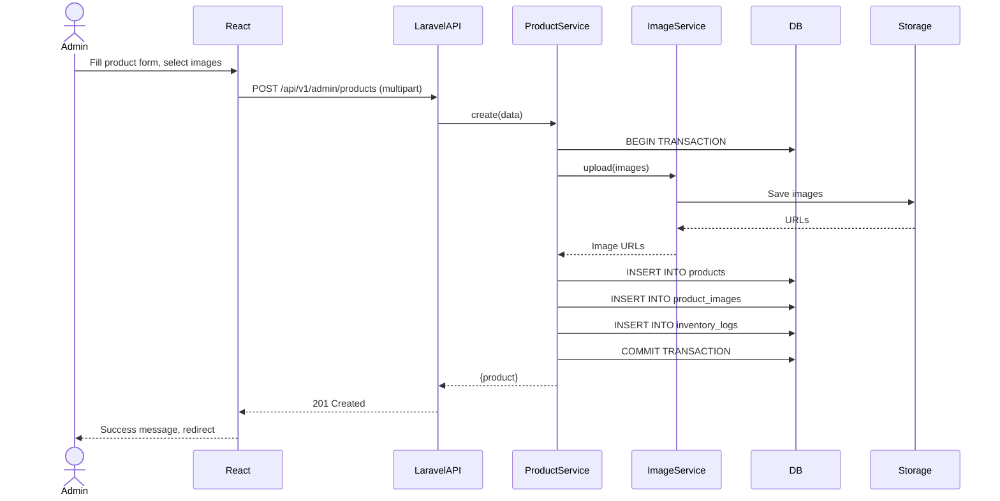

### 5.5 Scheduled CSV Report Generation

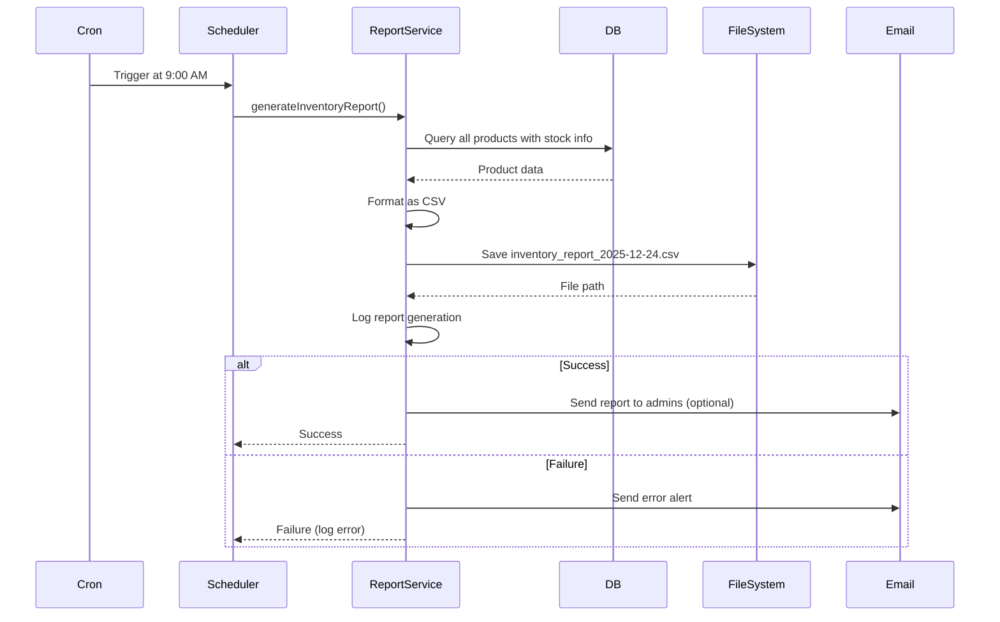

---

## 6. Database Component Diagram

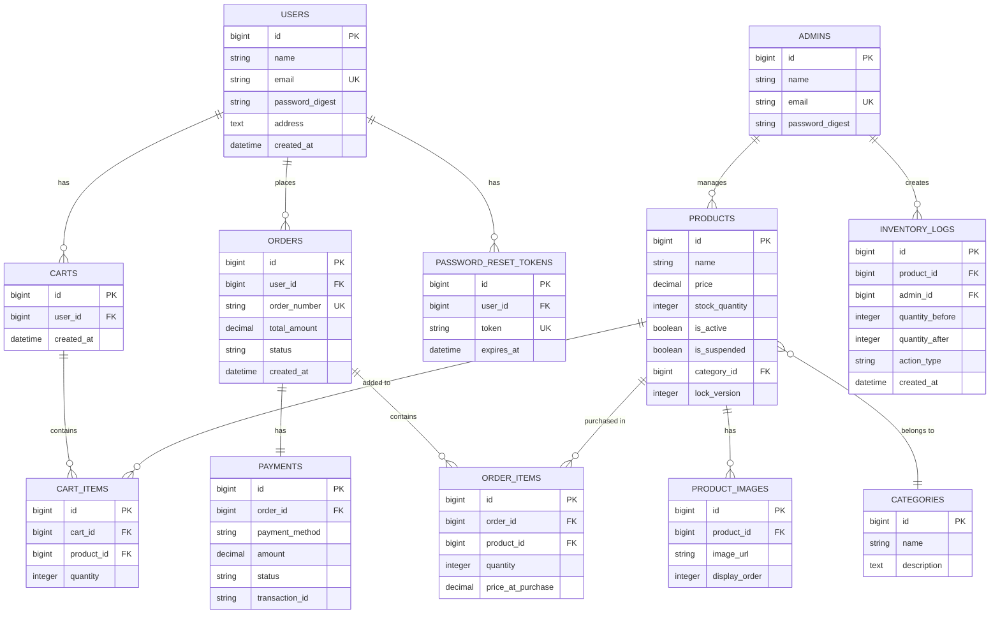

---

## 7. Security Component Diagram

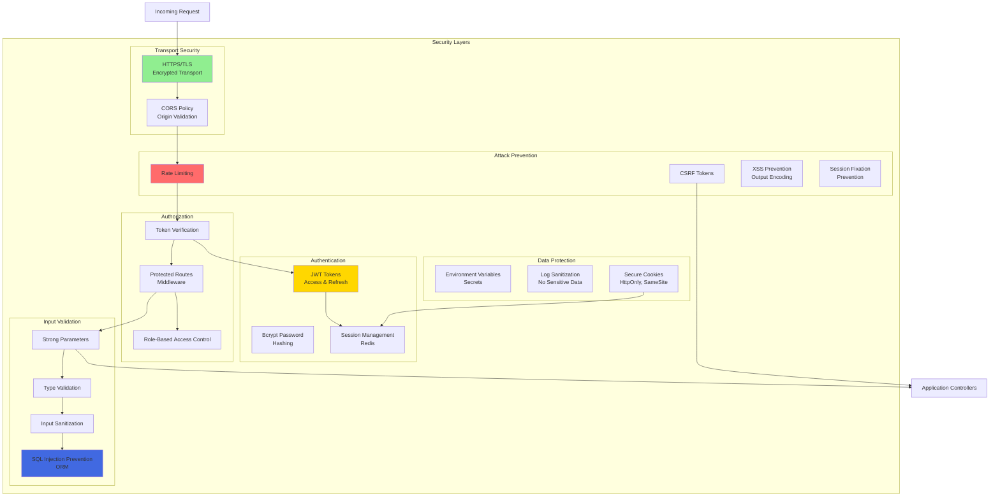

---

## 8. Deployment Component Diagram

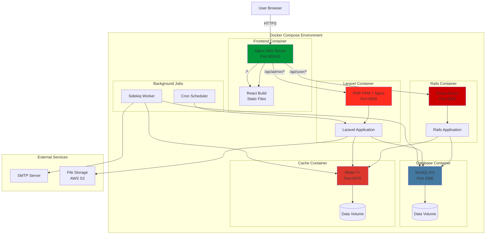

---

## 9. Testing Component Diagram

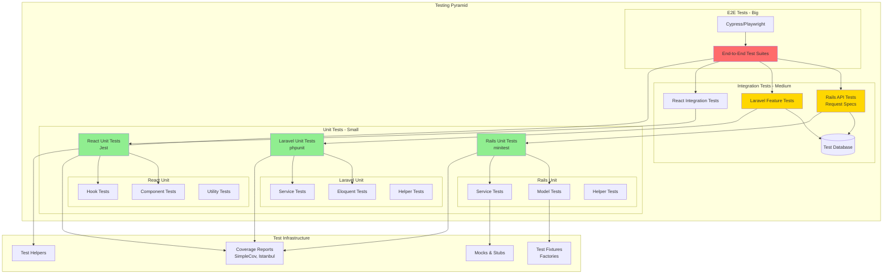

---

## 10. Monitoring & Logging Components

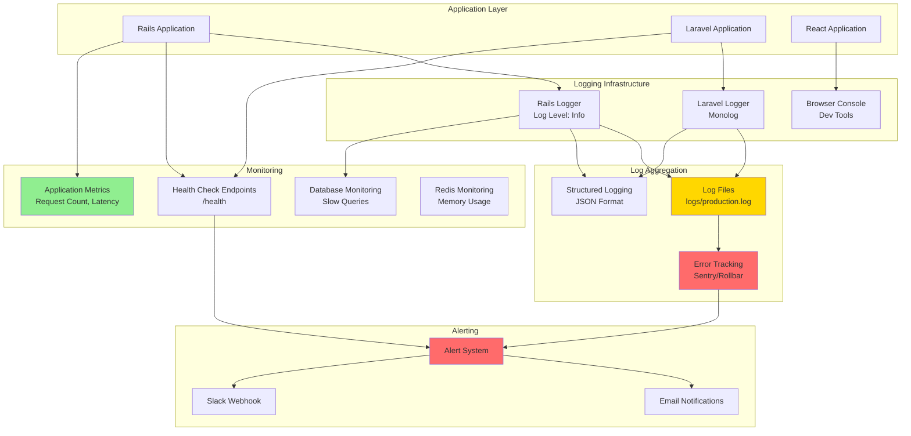

---

## 11. Component Interaction Matrix

| Component | Interacts With | Interaction Type | Purpose |
|-----------|----------------|------------------|---------|
| **React App** | Rails API | HTTP/REST | User feature API calls |
| **React App** | Laravel API | HTTP/REST | Admin feature API calls |
| **Rails API** | MySQL | TCP/SQL | User data persistence |
| **Laravel API** | MySQL | TCP/SQL | Admin data persistence |
| **Rails API** | Redis | TCP/Redis Protocol | Session storage, caching |
| **Laravel API** | Redis | TCP/Redis Protocol | Session storage, caching |
| **Rails API** | Sidekiq | Redis Queue | Background job processing |
| **Laravel API** | Task Scheduler | Cron | Scheduled tasks |
| **Sidekiq** | SMTP | SMTP Protocol | Email sending |
| **Laravel** | File Storage | S3 API / File System | Image uploads |
| **All Services** | Nginx | HTTP Reverse Proxy | Request routing |

---

## 12. Technology Stack Summary

| Layer | Technology | Version | Purpose |
|-------|-----------|---------|---------|
| **Frontend** | React | 18+ | SPA framework |
| | React Router | 6+ | Client-side routing |
| | Axios | 1.6+ | HTTP client |
| | Context API | Built-in | State management |
| **User Backend** | Ruby on Rails | 7+ | API framework |
| | Puma | 6+ | Web server |
| | ActiveRecord | Built-in | ORM |
| | BCrypt | 3.1+ | Password hashing |
| | JWT | 2.7+ | Token authentication |
| | Sidekiq | 7+ | Background jobs |
| **Admin Backend** | Laravel | 10+ | API framework |
| | PHP-FPM | 8.2+ | PHP processor |
| | Eloquent | Built-in | ORM |
| | Laravel Scheduler | Built-in | Cron jobs |
| **Database** | MySQL | 8.0+ | Relational database |
| **Cache/Session** | Redis | 7+ | In-memory store |
| **Web Server** | Nginx | 1.24+ | Reverse proxy, static files |
| **Containerization** | Docker | 24+ | Containerization |
| | docker-compose | 2.20+ | Multi-container orchestration |
| **Testing** | minitest | Built-in Rails | Rails unit tests |
| | phpunit | 10+ | Laravel unit tests |
| | Jest | 29+ | React unit tests |
| | Cypress | 13+ | E2E tests |

---

## Document Control

| Version | Date | Author | Changes |
|---------|------|--------|---------|
| 1.0 | 2025-12-24 | Development Team | Initial component diagram |

---

**Note**: These diagrams use Mermaid syntax and can be rendered in GitHub, GitLab, or any Markdown viewer that supports Mermaid. For best visualization, use tools like [Mermaid Live Editor](https://mermaid.live/).
