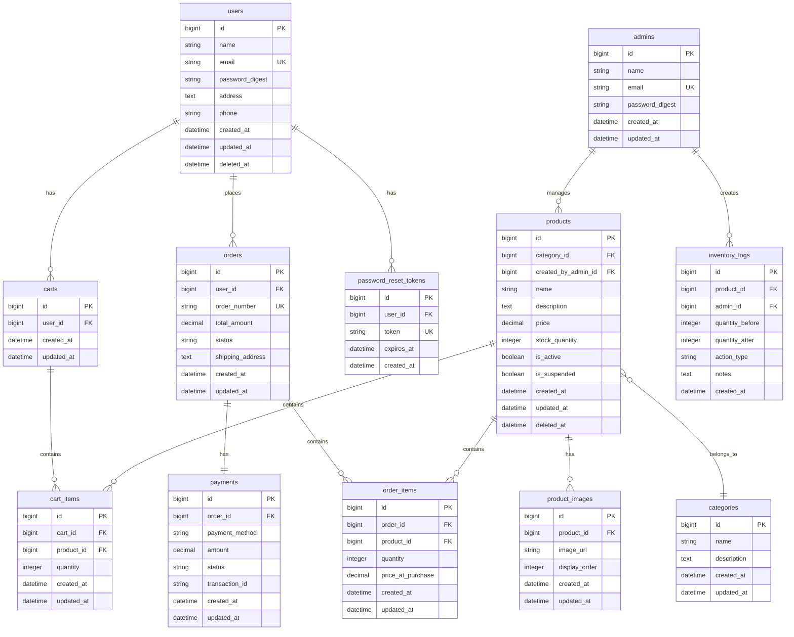

# ER Diagram - EC Site Application

## Entity Relationship Diagram

## Entity Descriptions

### Users
Represents customer accounts in the system.
- **Key fields**: email (unique identifier for login), password_digest (hashed password)
- **Soft delete**: Uses deleted_at for account deactivation
- **Relationships**: Can have multiple carts (historical), orders, and password reset tokens

### Admins
Represents administrative users who manage products and inventory.
- **Separation rationale**: Separate table from users for security isolation and different permission models
- **Relationships**: Manages products and creates inventory audit logs

### Products
Core entity representing items for sale.
- **Stock management**: stock_quantity tracks available inventory
- **Status flags**:
  - is_active: Product exists in the system
  - is_suspended: Temporarily unavailable for purchase (admin can toggle)
- **Soft delete**: Uses deleted_at for product archival
- **Relationships**: Belongs to category, has multiple images, appears in carts and orders

### Categories
Organizes products into logical groups.
- **Purpose**: Enables product filtering and navigation
- **Design note**: Simple one-level hierarchy; can be extended to nested categories if needed

### Product Images
Stores multiple images per product.
- **display_order**: Controls image sequence in product details
- **Design note**: Stores URLs rather than binary data for scalability

### Carts
Shopping cart for each user session.
- **Persistence**: Carts persist between sessions for better UX
- **Relationships**: Contains multiple cart_items

### Cart Items
Individual products added to a cart.
- **Quantity tracking**: Number of units for each product
- **Design note**: Separate entity to normalize data and handle multiple products

### Orders
Completed purchase records.
- **order_number**: Human-readable unique identifier
- **status**: Tracks order lifecycle (pending, processing, shipped, completed, cancelled)
- **Snapshot data**: shipping_address captured at order time
- **Relationships**: Contains order_items and has one payment

### Order Items
Individual products within an order.
- **price_at_purchase**: Historical price snapshot (products prices may change over time)
- **Design rationale**: Separates order from product to maintain historical accuracy

### Payments
Payment transaction records.
- **status**: Tracks payment state (pending, completed, failed, refunded)
- **transaction_id**: External payment gateway reference
- **Design note**: Mock implementation; ready for payment gateway integration

### Password Reset Tokens
Manages password reset workflow.
- **expires_at**: Token validity period (typically 1-24 hours)
- **Security**: One-time use tokens, deleted after use

### Inventory Logs
Audit trail for inventory changes.
- **action_type**: Type of change (restock, sale, adjustment, return)
- **Traceability**: Links changes to specific admins
- **Purpose**: Compliance and debugging inventory discrepancies

## Design Decisions

### Database Constraints
- **Foreign Keys**: All FK relationships have database-level constraints for referential integrity
- **Unique Indexes**: email fields, order_number, reset tokens
- **Null Constraints**: Critical fields like email, password_digest are NOT NULL

### Concurrency Handling
Products table will use optimistic locking (version column) or database row-level locking for concurrent purchase scenarios.

### Performance Considerations
- **Indexes**:
  - All FK columns
  - email columns (login queries)
  - order_number (order lookup)
  - product.is_active and is_suspended (filtering)
  - created_at columns (time-based queries)

### Data Integrity
- **Soft Deletes**: users and products use soft deletes to maintain referential integrity in historical orders
- **Price Snapshots**: order_items stores price_at_purchase to preserve historical accuracy
- **Audit Trail**: inventory_logs provides complete change history

## Schema Normalization
The schema follows 3NF (Third Normal Form):
- No transitive dependencies
- Each table has a single primary key
- Repeating groups are eliminated (cart_items, order_items)

## Future Extensibility
The design supports future enhancements:
- Product variants (size, color) - can add product_variants table
- User reviews - can add reviews table
- Wishlist - similar structure to carts
- Multiple shipping addresses - can add user_addresses table
- Discount codes - can add promotions table
