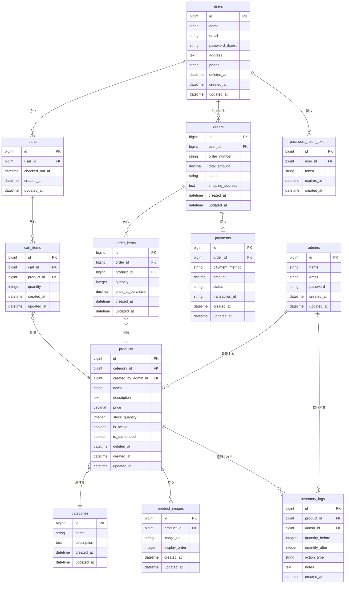

# ER図

## テーブルの関係図

```mermaid
erDiagram
    users ||--o{ carts : "持つ"
    users ||--o{ orders : "注文する"
    users ||--o{ password_reset_tokens : "持つ"

    carts ||--o{ cart_items : "含む"
    cart_items }o--|| products : "参照"

    orders ||--o{ order_items : "含む"
    orders ||--o| payments : "持つ"
    order_items }o--|| products : "参照"

    products }o--|| categories : "属する"
    products ||--o{ product_images : "持つ"
    products ||--o{ inventory_logs : "記録される"

    admins ||--o{ products : "登録する"
    admins ||--o{ inventory_logs : "操作する"

    users {
        bigint id PK
        string name
        string email
        string password_digest
        text address
        string phone
        datetime deleted_at
        datetime created_at
        datetime updated_at
    }

    carts {
        bigint id PK
        bigint user_id FK
        datetime checked_out_at
        datetime created_at
        datetime updated_at
    }

    cart_items {
        bigint id PK
        bigint cart_id FK
        bigint product_id FK
        integer quantity
        datetime created_at
        datetime updated_at
    }

    products {
        bigint id PK
        bigint category_id FK
        bigint created_by_admin_id FK
        string name
        text description
        decimal price
        integer stock_quantity
        boolean is_active
        boolean is_suspended
        datetime deleted_at
        datetime created_at
        datetime updated_at
    }

    categories {
        bigint id PK
        string name
        text description
        datetime created_at
        datetime updated_at
    }

    product_images {
        bigint id PK
        bigint product_id FK
        string image_url
        integer display_order
        datetime created_at
        datetime updated_at
    }

    orders {
        bigint id PK
        bigint user_id FK
        string order_number
        decimal total_amount
        string status
        text shipping_address
        datetime created_at
        datetime updated_at
    }

    order_items {
        bigint id PK
        bigint order_id FK
        bigint product_id FK
        integer quantity
        decimal price_at_purchase
        datetime created_at
        datetime updated_at
    }

    payments {
        bigint id PK
        bigint order_id FK
        string payment_method
        decimal amount
        string status
        string transaction_id
        datetime created_at
        datetime updated_at
    }

    admins {
        bigint id PK
        string name
        string email
        string password
        datetime created_at
        datetime updated_at
    }

    inventory_logs {
        bigint id PK
        bigint product_id FK
        bigint admin_id FK
        integer quantity_before
        integer quantity_after
        string action_type
        text notes
        datetime created_at
    }

    password_reset_tokens {
        bigint id PK
        bigint user_id FK
        string token
        datetime expires_at
        datetime created_at
    }
```

---

## 設計で悩んだところ・メモ

### カートと注文を別テーブルにした理由

最初はカートと注文を同じテーブルで管理しようとしたのですが、
チェックアウト前と後で状態が全然違うので別々にしました。

`carts` → `checked_out_at` がnullなら「まだカートに入ってる状態」
チェックアウトすると `orders` と `order_items` に内容がコピーされます。

### price_at_purchase について

`order_items` に `price_at_purchase`（購入時の価格）カラムを持たせています。
これは注文した後に商品の価格が変わっても、注文時の価格が残るようにするためです。
最初 `unit_price` という名前にしていたらテストが全部落ちて、しばらく理由がわかりませんでした…

### ソフトデリート（deleted_at）

`users` と `products` は実際には消さずに `deleted_at` に日時を入れる方法にしました。
本当に消すと、その人の注文履歴とかが壊れてしまうので。
調べたら「ソフトデリート」という名前のよくある設計パターンらしいです。

### inventory_logs テーブル

在庫が増えたり減ったりした履歴を全部残しています。
「誰が」「いつ」「何個変えたか」が分かるようにするためです。
`action_type` には `restock`（入荷）・`sale`（売れた）・`adjustment`（手動調整）などが入ります。
