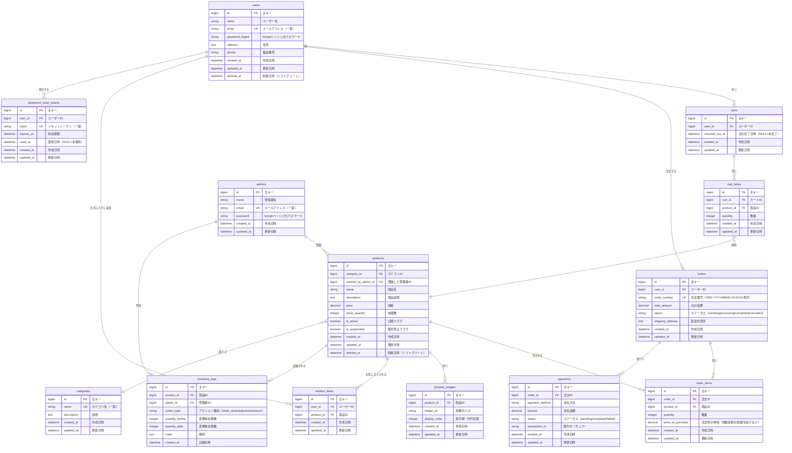

# ER図 - ECサイト データベース設計

## エンティティ関係図

このドキュメントでは、ECサイトアプリケーションのデータベース設計を説明します。

### システム概要

- **Rails API**: ユーザー向け機能（users, orders, carts, wishlist_items）
- **Laravel API**: 管理者向け機能（admins, inventory_logs）
- **共有テーブル**: products, categories, product_images

```mermaid
erDiagram
    users ||--o{ carts : "持つ"
    users ||--o{ orders : "注文する"
    users ||--o{ wishlist_items : "お気に入りに追加"
    users ||--o{ password_reset_tokens : "発行する"

    carts ||--o{ cart_items : "含む"
    cart_items }o--|| products : "参照"

    products ||--o{ order_items : "含まれる"
    products ||--o{ product_images : "持つ"
    products ||--o{ wishlist_items : "お気に入りされる"
    products ||--o{ inventory_logs : "記録される"
    products }o--|| categories : "属する"

    orders ||--o{ order_items : "含む"
    orders ||--o{ payments : "紐づく"

    admins ||--o{ products : "登録"
    admins ||--o{ inventory_logs : "作成"

    users {
        bigint id PK "主キー"
        string name "ユーザー名"
        string email UK "メールアドレス（一意）"
        string password_digest "bcryptハッシュ化パスワード"
        text address "住所"
        string phone "電話番号"
        datetime created_at "作成日時"
        datetime updated_at "更新日時"
        datetime deleted_at "削除日時（ソフトデリート）"
    }

    admins {
        bigint id PK "主キー"
        string name "管理者名"
        string email UK "メールアドレス（一意）"
        string password "bcryptハッシュ化パスワード"
        datetime created_at "作成日時"
        datetime updated_at "更新日時"
    }

    products {
        bigint id PK "主キー"
        bigint category_id FK "カテゴリID"
        bigint created_by_admin_id FK "登録した管理者ID"
        string name "商品名"
        text description "商品説明"
        decimal price "価格"
        integer stock_quantity "在庫数"
        boolean is_active "公開フラグ"
        boolean is_suspended "販売停止フラグ"
        datetime created_at "作成日時"
        datetime updated_at "更新日時"
        datetime deleted_at "削除日時（ソフトデリート）"
    }

    categories {
        bigint id PK "主キー"
        string name UK "カテゴリ名（一意）"
        text description "説明"
        datetime created_at "作成日時"
        datetime updated_at "更新日時"
    }

    product_images {
        bigint id PK "主キー"
        bigint product_id FK "商品ID"
        string image_url "画像のパス"
        integer display_order "表示順（0が先頭）"
        datetime created_at "作成日時"
        datetime updated_at "更新日時"
    }

    carts {
        bigint id PK "主キー"
        bigint user_id FK "ユーザーID"
        datetime checked_out_at "注文完了日時（NULL=未完了）"
        datetime created_at "作成日時"
        datetime updated_at "更新日時"
    }

    cart_items {
        bigint id PK "主キー"
        bigint cart_id FK "カートID"
        bigint product_id FK "商品ID"
        integer quantity "数量"
        datetime created_at "作成日時"
        datetime updated_at "更新日時"
    }

    orders {
        bigint id PK "主キー"
        bigint user_id FK "ユーザーID"
        string order_number UK "注文番号（ORD-YYYYMMDD-XXXXXX形式）"
        decimal total_amount "合計金額"
        string status "ステータス（pending/processing/completed/cancelled）"
        text shipping_address "配送先住所"
        datetime created_at "作成日時"
        datetime updated_at "更新日時"
    }

    order_items {
        bigint id PK "主キー"
        bigint order_id FK "注文ID"
        bigint product_id FK "商品ID"
        integer quantity "数量"
        decimal price_at_purchase "注文時の単価（価格変動の影響を受けない）"
        datetime created_at "作成日時"
        datetime updated_at "更新日時"
    }

    payments {
        bigint id PK "主キー"
        bigint order_id FK "注文ID"
        string payment_method "支払方法"
        decimal amount "支払金額"
        string status "ステータス（pending/completed/failed）"
        string transaction_id "取引ID（モック）"
        datetime created_at "作成日時"
        datetime updated_at "更新日時"
    }

    wishlist_items {
        bigint id PK "主キー"
        bigint user_id FK "ユーザーID"
        bigint product_id FK "商品ID"
        datetime created_at "作成日時"
        datetime updated_at "更新日時"
    }

    password_reset_tokens {
        bigint id PK "主キー"
        bigint user_id FK "ユーザーID"
        string token UK "リセットトークン（一意）"
        datetime expires_at "有効期限"
        datetime used_at "使用日時（NULL=未使用）"
        datetime created_at "作成日時"
        datetime updated_at "更新日時"
    }

    inventory_logs {
        bigint id PK "主キー"
        bigint product_id FK "商品ID"
        bigint admin_id FK "管理者ID"
        string action_type "アクション種別（initial_stock/adjustment/return）"
        integer quantity_before "変更前在庫数"
        integer quantity_after "変更後在庫数"
        text notes "備考"
        datetime created_at "記録日時"
    }
```

## テーブル詳細

### 1. users（ユーザー）- Rails管理

顧客アカウント情報を保存します。

| カラム名 | 型 | 制約 | 説明 |
|---------|-----|------|-----|
| id | bigint | PK | 主キー |
| name | string | NOT NULL | ユーザー名 |
| email | string | UNIQUE, NOT NULL | メールアドレス（ログインID） |
| password_digest | string | NOT NULL | bcryptでハッシュ化されたパスワード |
| address | text | NULL | 配送先住所 |
| phone | string | NULL | 電話番号 |
| created_at | datetime | NOT NULL | 作成日時 |
| updated_at | datetime | NOT NULL | 更新日時 |
| deleted_at | datetime | NULL | 削除日時（ソフトデリート） |

**インデックス**:
- `email` (UNIQUE)
- `deleted_at`

---

### 2. admins（管理者）- Laravel管理

管理者アカウント情報を保存します。

| カラム名 | 型 | 制約 | 説明 |
|---------|-----|------|-----|
| id | bigint | PK | 主キー |
| name | string | NOT NULL | 管理者名 |
| email | string | UNIQUE, NOT NULL | メールアドレス（ログインID） |
| password | string | NOT NULL | bcryptでハッシュ化されたパスワード |
| created_at | datetime | NOT NULL | 作成日時 |
| updated_at | datetime | NOT NULL | 更新日時 |

**インデックス**:
- `email` (UNIQUE)

---

### 3. products（商品）- Rails & Laravel共有

商品カタログ情報を保存します。

| カラム名 | 型 | 制約 | 説明 |
|---------|-----|------|-----|
| id | bigint | PK | 主キー |
| category_id | bigint | FK, NOT NULL | カテゴリID |
| created_by_admin_id | bigint | FK, NULL | 登録した管理者のID |
| name | string | NOT NULL | 商品名 |
| description | text | NOT NULL | 商品説明 |
| price | decimal(10,2) | NOT NULL | 価格 |
| stock_quantity | integer | NOT NULL, DEFAULT 0 | 在庫数 |
| is_active | boolean | DEFAULT true | 公開フラグ（falseで非公開） |
| is_suspended | boolean | DEFAULT false | 販売停止フラグ（trueで「販売停止中」表示） |
| created_at | datetime | NOT NULL | 作成日時 |
| updated_at | datetime | NOT NULL | 更新日時 |
| deleted_at | datetime | NULL | 削除日時（ソフトデリート） |

**インデックス**:
- `category_id`
- `(is_active, is_suspended)` 複合インデックス
- `deleted_at`
- `name`
- `created_at`

---

### 4. categories（カテゴリ）- Rails & Laravel共有

商品カテゴリ情報を保存します。

| カラム名 | 型 | 制約 | 説明 |
|---------|-----|------|-----|
| id | bigint | PK | 主キー |
| name | string | UNIQUE, NOT NULL | カテゴリ名 |
| description | text | NULL | カテゴリの説明 |
| created_at | datetime | NOT NULL | 作成日時 |
| updated_at | datetime | NOT NULL | 更新日時 |

**インデックス**:
- `name` (UNIQUE)

---

### 5. product_images（商品画像）- Rails & Laravel共有

商品の画像情報を保存します。画像ファイル本体は `storage/app/public/images/` に保存されます。

| カラム名 | 型 | 制約 | 説明 |
|---------|-----|------|-----|
| id | bigint | PK | 主キー |
| product_id | bigint | FK, NOT NULL | 商品ID |
| image_url | string | NOT NULL | 画像のパス |
| display_order | integer | NOT NULL, DEFAULT 0 | 表示順（0が先頭） |
| created_at | datetime | NOT NULL | 作成日時 |
| updated_at | datetime | NOT NULL | 更新日時 |

**インデックス**:
- `product_id`
- `(product_id, display_order)` 複合インデックス

---

### 6. carts（カート）- Rails管理

ユーザーごとのカートを管理します。チェックアウト後は `checked_out_at` に日時が入ります。

| カラム名 | 型 | 制約 | 説明 |
|---------|-----|------|-----|
| id | bigint | PK | 主キー |
| user_id | bigint | FK, NOT NULL | ユーザーID |
| checked_out_at | datetime | NULL | 注文完了日時（NULLの間は現在のカート） |
| created_at | datetime | NOT NULL | 作成日時 |
| updated_at | datetime | NOT NULL | 更新日時 |

**インデックス**:
- `user_id`
- `(user_id, checked_out_at)` 複合インデックス（未チェックアウトのカートを高速に検索）

---

### 7. cart_items（カートアイテム）- Rails管理

カート内の商品と数量を保存します。

| カラム名 | 型 | 制約 | 説明 |
|---------|-----|------|-----|
| id | bigint | PK | 主キー |
| cart_id | bigint | FK, NOT NULL | カートID |
| product_id | bigint | FK, NOT NULL | 商品ID |
| quantity | integer | NOT NULL, DEFAULT 1 | 数量 |
| created_at | datetime | NOT NULL | 作成日時 |
| updated_at | datetime | NOT NULL | 更新日時 |

**インデックス**:
- `cart_id`
- `product_id`
- UNIQUE(`cart_id`, `product_id`)（同じ商品の重複追加を防ぐ）

---

### 8. orders（注文）- Rails管理

ユーザーの注文情報を保存します。

| カラム名 | 型 | 制約 | 説明 |
|---------|-----|------|-----|
| id | bigint | PK | 主キー |
| user_id | bigint | FK, NOT NULL | ユーザーID |
| order_number | string | UNIQUE, NOT NULL | 注文番号（ORD-YYYYMMDD-XXXXXX形式） |
| total_amount | decimal(10,2) | NOT NULL | 合計金額 |
| status | string | NOT NULL, DEFAULT 'pending' | ステータス |
| shipping_address | text | NOT NULL | 配送先住所 |
| created_at | datetime | NOT NULL | 作成日時 |
| updated_at | datetime | NOT NULL | 更新日時 |

**インデックス**:
- `user_id`
- `(user_id, created_at)` 複合インデックス
- `order_number` (UNIQUE)
- `status`
- `created_at`

---

### 9. order_items（注文明細）- Rails管理

注文の商品明細を保存します。`price_at_purchase` に注文時点の価格を保存するので、後から商品価格が変わっても過去の注文履歴に影響しません。

| カラム名 | 型 | 制約 | 説明 |
|---------|-----|------|-----|
| id | bigint | PK | 主キー |
| order_id | bigint | FK, NOT NULL | 注文ID |
| product_id | bigint | FK, NOT NULL | 商品ID |
| quantity | integer | NOT NULL | 数量 |
| price_at_purchase | decimal(10,2) | NOT NULL | 注文時の単価（スナップショット） |
| created_at | datetime | NOT NULL | 作成日時 |
| updated_at | datetime | NOT NULL | 更新日時 |

**インデックス**:
- `order_id`
- `product_id`

---

### 10. payments（決済）- Rails管理

注文に紐づく決済情報を保存します。今回は実際の決済は行わずモックですが、テーブル設計は本番を意識した構造にしました。

| カラム名 | 型 | 制約 | 説明 |
|---------|-----|------|-----|
| id | bigint | PK | 主キー |
| order_id | bigint | FK, NOT NULL | 注文ID |
| payment_method | string | NOT NULL | 支払方法 |
| amount | decimal(10,2) | NOT NULL | 支払金額 |
| status | string | NOT NULL, DEFAULT 'pending' | ステータス（pending/completed/failed） |
| transaction_id | string | NULL | 取引ID（実際の決済サービスから返るID） |
| created_at | datetime | NOT NULL | 作成日時 |
| updated_at | datetime | NOT NULL | 更新日時 |

**インデックス**:
- `order_id`
- `status`
- `transaction_id`

---

### 11. wishlist_items（お気に入り）- Rails管理

ユーザーのお気に入り商品を保存します。同じ商品の重複登録は UNIQUE 制約で防いでいます。

| カラム名 | 型 | 制約 | 説明 |
|---------|-----|------|-----|
| id | bigint | PK | 主キー |
| user_id | bigint | FK, NOT NULL | ユーザーID |
| product_id | bigint | FK, NOT NULL | 商品ID |
| created_at | datetime | NOT NULL | 作成日時 |
| updated_at | datetime | NOT NULL | 更新日時 |

**インデックス**:
- `user_id`
- `product_id`
- UNIQUE(`user_id`, `product_id`)

---

### 12. password_reset_tokens（パスワードリセットトークン）- Rails管理

パスワードリセット用のトークンを保存します。メール送信は今回実装していませんが、トークン発行の仕組みだけ作りました。

| カラム名 | 型 | 制約 | 説明 |
|---------|-----|------|-----|
| id | bigint | PK | 主キー |
| user_id | bigint | FK, NOT NULL | ユーザーID |
| token | string | UNIQUE, NOT NULL | リセットトークン |
| expires_at | datetime | NOT NULL | 有効期限 |
| used_at | datetime | NULL | 使用日時（NULLなら未使用） |
| created_at | datetime | NOT NULL | 作成日時 |
| updated_at | datetime | NOT NULL | 更新日時 |

**インデックス**:
- `token` (UNIQUE)
- `user_id`
- `(user_id, expires_at)` 複合インデックス

---

### 13. inventory_logs（在庫変更ログ）- Laravel管理

商品の在庫変更履歴を監査ログとして保存します。変更前・変更後の数量を両方記録するので、どこかでおかしくなっても遡れるようにしています。

| カラム名 | 型 | 制約 | 説明 |
|---------|-----|------|-----|
| id | bigint | PK | 主キー |
| product_id | bigint | FK, NOT NULL | 商品ID |
| admin_id | bigint | FK, NULL | 操作した管理者ID |
| action_type | string | NOT NULL | アクション種別（initial_stock/adjustment/return） |
| quantity_before | integer | NOT NULL | 変更前の在庫数 |
| quantity_after | integer | NOT NULL | 変更後の在庫数 |
| notes | text | NULL | 備考 |
| created_at | datetime | NOT NULL | 記録日時 |

**インデックス**:
- `product_id`
- `admin_id`
- `action_type`
- `created_at`

---

## ビジネスルール

### 1. 在庫管理
- 商品の在庫数は0以上でなければならない
- 注文時に在庫をロック（`SELECT FOR UPDATE`）し、同時購入による競合を防ぐ
- すべての在庫変更は `inventory_logs` に記録される

### 2. 注文処理
- 注文確定時に在庫数を減少させる（SQLのWHERE条件で在庫チェックも兼ねる）
- 注文キャンセル時に在庫数を戻す
- `order_items.price_at_purchase` に注文時の価格を保存する（商品価格変動への対応）

### 3. カートの設計
- カートは `carts` テーブルで管理し、チェックアウト済みかどうかは `checked_out_at` で判断する
- 注文完了後はカートをチェックアウト済みにして、新しいカートを作成する方式

### 4. ソフトデリート
- `users` と `products` はソフトデリート（`deleted_at` に日時が入るだけ）
- 削除されたユーザーのデータは保持（注文履歴などが残るため）
- 削除された商品は非表示だが、過去の `order_items` には残る

---

**最終更新**: 2026-04-19
