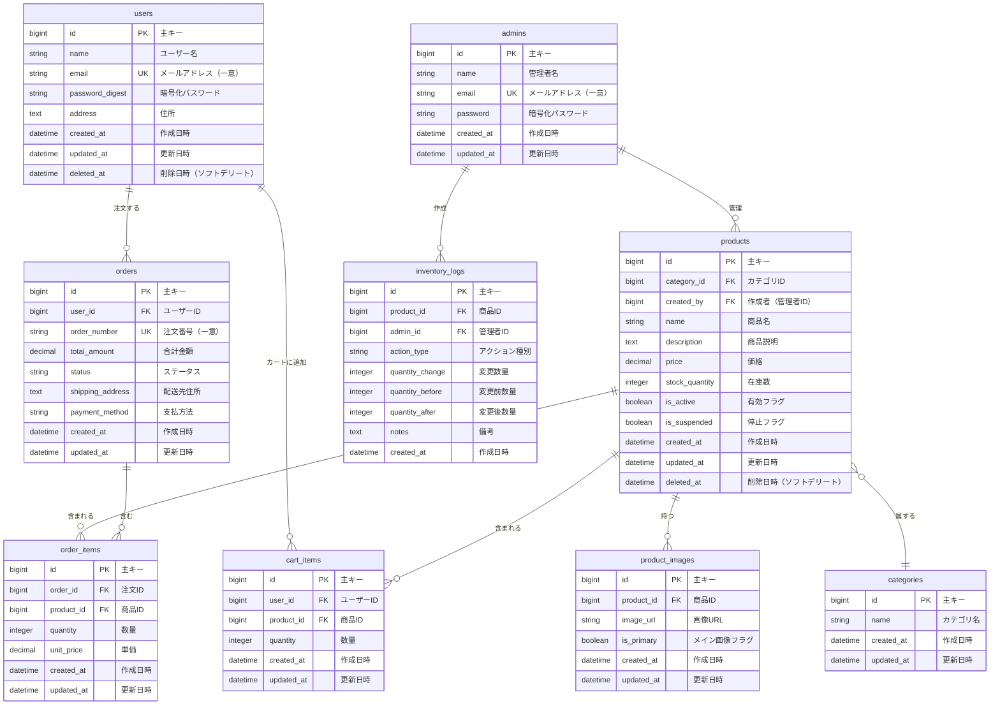

# ER図 - ECサイト データベース設計

## エンティティ関係図

このドキュメントでは、ECサイトアプリケーションのデータベース設計を説明します。

### システム概要

- **Rails API**: ユーザー向け機能（users, orders, cart_items）
- **Laravel API**: 管理者向け機能（admins, inventory_logs）
- **共有テーブル**: products, categories, product_images



## テーブル詳細

### 1. users（ユーザー）- Rails管理

顧客アカウント情報を保存します。

| カラム名 | 型 | 制約 | 説明 |
|---------|-----|------|-----|
| id | bigint | PK | 主キー |
| name | string | NOT NULL | ユーザー名 |
| email | string | UNIQUE, NOT NULL | メールアドレス（ログインID） |
| password_digest | string | NOT NULL | bcryptでハッシュ化されたパスワード |
| address | text | NULL | 配送先住所 |
| created_at | datetime | NOT NULL | 作成日時 |
| updated_at | datetime | NOT NULL | 更新日時 |
| deleted_at | datetime | NULL | 削除日時（ソフトデリート） |

**インデックス**:
- `email` (UNIQUE)
- `deleted_at`

### 2. admins（管理者）- Laravel管理

管理者アカウント情報を保存します。

| カラム名 | 型 | 制約 | 説明 |
|---------|-----|------|-----|
| id | bigint | PK | 主キー |
| name | string | NOT NULL | 管理者名 |
| email | string | UNIQUE, NOT NULL | メールアドレス（ログインID） |
| password | string | NOT NULL | bcryptでハッシュ化されたパスワード |
| created_at | datetime | NOT NULL | 作成日時 |
| updated_at | datetime | NOT NULL | 更新日時 |

**インデックス**:
- `email` (UNIQUE)

### 3. products（商品）- Rails & Laravel共有

商品カタログ情報を保存します。

| カラム名 | 型 | 制約 | 説明 |
|---------|-----|------|-----|
| id | bigint | PK | 主キー |
| category_id | bigint | FK, NOT NULL | カテゴリID |
| created_by | bigint | FK, NULL | 作成した管理者のID |
| name | string | NOT NULL | 商品名 |
| description | text | NULL | 商品説明 |
| price | decimal(10,2) | NOT NULL | 価格 |
| stock_quantity | integer | NOT NULL, DEFAULT 0 | 在庫数 |
| is_active | boolean | DEFAULT true | 有効フラグ |
| is_suspended | boolean | DEFAULT false | 停止フラグ（管理者による一時停止） |
| created_at | datetime | NOT NULL | 作成日時 |
| updated_at | datetime | NOT NULL | 更新日時 |
| deleted_at | datetime | NULL | 削除日時（ソフトデリート） |

**インデックス**:
- `category_id`
- `is_active`
- `is_suspended`
- `deleted_at`

### 4. categories（カテゴリ）- Rails & Laravel共有

商品カテゴリ情報を保存します。

| カラム名 | 型 | 制約 | 説明 |
|---------|-----|------|-----|
| id | bigint | PK | 主キー |
| name | string | UNIQUE, NOT NULL | カテゴリ名 |
| created_at | datetime | NOT NULL | 作成日時 |
| updated_at | datetime | NOT NULL | 更新日時 |

**インデックス**:
- `name` (UNIQUE)

### 5. product_images（商品画像）- Rails & Laravel共有

商品の画像情報を保存します。

| カラム名 | 型 | 制約 | 説明 |
|---------|-----|------|-----|
| id | bigint | PK | 主キー |
| product_id | bigint | FK, NOT NULL | 商品ID |
| image_url | string | NOT NULL | 画像のURL |
| is_primary | boolean | DEFAULT false | メイン画像フラグ |
| created_at | datetime | NOT NULL | 作成日時 |
| updated_at | datetime | NOT NULL | 更新日時 |

**インデックス**:
- `product_id`
- `is_primary`

### 6. cart_items（カートアイテム）- Rails管理

ユーザーのショッピングカート内容を保存します。

| カラム名 | 型 | 制約 | 説明 |
|---------|-----|------|-----|
| id | bigint | PK | 主キー |
| user_id | bigint | FK, NOT NULL | ユーザーID |
| product_id | bigint | FK, NOT NULL | 商品ID |
| quantity | integer | NOT NULL, > 0 | 数量 |
| created_at | datetime | NOT NULL | 作成日時 |
| updated_at | datetime | NOT NULL | 更新日時 |

**インデックス**:
- `user_id`
- `product_id`
- UNIQUE(`user_id`, `product_id`)

### 7. orders（注文）- Rails管理

ユーザーの注文情報を保存します。

| カラム名 | 型 | 制約 | 説明 |
|---------|-----|------|-----|
| id | bigint | PK | 主キー |
| user_id | bigint | FK, NOT NULL | ユーザーID |
| order_number | string | UNIQUE, NOT NULL | 注文番号（ORD-YYYYMMDD-XXXXXX形式） |
| total_amount | decimal(10,2) | NOT NULL | 合計金額 |
| status | string | NOT NULL | ステータス（pending/processing/completed/cancelled） |
| shipping_address | text | NOT NULL | 配送先住所 |
| payment_method | string | NULL | 支払方法 |
| created_at | datetime | NOT NULL | 作成日時 |
| updated_at | datetime | NOT NULL | 更新日時 |

**インデックス**:
- `user_id`
- `order_number` (UNIQUE)
- `status`

### 8. order_items（注文明細）- Rails管理

注文の商品明細を保存します。

| カラム名 | 型 | 制約 | 説明 |
|---------|-----|------|-----|
| id | bigint | PK | 主キー |
| order_id | bigint | FK, NOT NULL | 注文ID |
| product_id | bigint | FK, NOT NULL | 商品ID |
| quantity | integer | NOT NULL, > 0 | 数量 |
| unit_price | decimal(10,2) | NOT NULL | 単価（注文時の価格） |
| created_at | datetime | NOT NULL | 作成日時 |
| updated_at | datetime | NOT NULL | 更新日時 |

**インデックス**:
- `order_id`
- `product_id`

### 9. inventory_logs（在庫変更ログ）- Laravel管理

商品の在庫変更履歴を監査ログとして保存します。

| カラム名 | 型 | 制約 | 説明 |
|---------|-----|------|-----|
| id | bigint | PK | 主キー |
| product_id | bigint | FK, NOT NULL | 商品ID |
| admin_id | bigint | FK, NOT NULL | 管理者ID |
| action_type | string | NOT NULL | アクション種別（initial/adjustment/sale/return） |
| quantity_change | integer | NOT NULL | 変更数量（±） |
| quantity_before | integer | NOT NULL | 変更前在庫数 |
| quantity_after | integer | NOT NULL | 変更後在庫数 |
| notes | text | NULL | 備考 |
| created_at | datetime | NOT NULL | 作成日時 |

**インデックス**:
- `product_id`
- `admin_id`
- `action_type`
- `created_at`

## データベース制約

### 外部キー制約

```sql
-- Products
ALTER TABLE products
  ADD CONSTRAINT fk_products_category 
  FOREIGN KEY (category_id) REFERENCES categories(id) ON DELETE CASCADE,
  ADD CONSTRAINT fk_products_admin 
  FOREIGN KEY (created_by) REFERENCES admins(id) ON DELETE SET NULL;

-- Product Images
ALTER TABLE product_images
  ADD CONSTRAINT fk_product_images_product 
  FOREIGN KEY (product_id) REFERENCES products(id) ON DELETE CASCADE;

-- Cart Items
ALTER TABLE cart_items
  ADD CONSTRAINT fk_cart_items_user 
  FOREIGN KEY (user_id) REFERENCES users(id) ON DELETE CASCADE,
  ADD CONSTRAINT fk_cart_items_product 
  FOREIGN KEY (product_id) REFERENCES products(id) ON DELETE CASCADE;

-- Orders
ALTER TABLE orders
  ADD CONSTRAINT fk_orders_user 
  FOREIGN KEY (user_id) REFERENCES users(id) ON DELETE RESTRICT;

-- Order Items
ALTER TABLE order_items
  ADD CONSTRAINT fk_order_items_order 
  FOREIGN KEY (order_id) REFERENCES orders(id) ON DELETE CASCADE,
  ADD CONSTRAINT fk_order_items_product 
  FOREIGN KEY (product_id) REFERENCES products(id) ON DELETE RESTRICT;

-- Inventory Logs
ALTER TABLE inventory_logs
  ADD CONSTRAINT fk_inventory_logs_product 
  FOREIGN KEY (product_id) REFERENCES products(id) ON DELETE CASCADE,
  ADD CONSTRAINT fk_inventory_logs_admin 
  FOREIGN KEY (admin_id) REFERENCES admins(id) ON DELETE RESTRICT;
```

## ビジネスルール

### 1. 在庫管理
- 商品の在庫数は0以上でなければならない
- 注文時に在庫をロックし、同時購入による競合を防ぐ
- すべての在庫変更はinventory_logsに記録される

### 2. 注文処理
- 注文確定時に在庫数を減少させる
- 注文キャンセル時に在庫数を戻す
- 注文確定後のorder_itemsは変更不可

### 3. ソフトデリート
- users と products はソフトデリート（deleted_at）
- 削除されたユーザーのデータは保持（監査目的）
- 削除された商品は非表示だが、過去の注文データには残る

### 4. 価格の保存
- order_items.unit_price に注文時の価格を保存
- 商品価格が変更されても過去の注文には影響しない

---

**最終更新**: 2025-12-25

詳細な英語版ドキュメントは [ER_Diagram.md](ER_Diagram.md) を参照してください。
